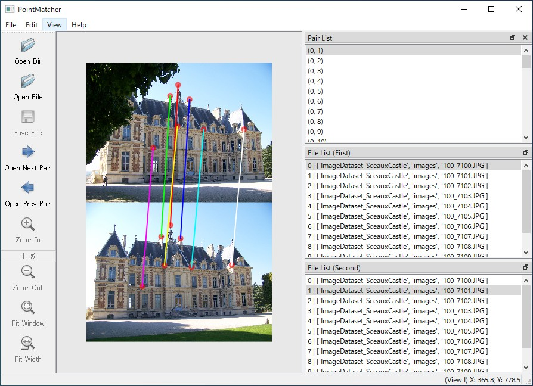

# PointMatcher

 PointMatcher is a graphical corresponding point annotation tool. In computer vision, normally we decide correspondences of points automatically by a feature point extraction algorithm (e.g. SIFT) and a feature matching algorithm (e.g. Brute Force). But when you want to do it manually, you can use this tool!

<p align="center"></img></p>

## Requirements

* Python3
* PyQT5

## How to Start

### with Binary (Windows only)

You can use binary file. Please download from the [Release](https://github.com/daisatojp/PointMatcher/releases).

### with git-clone (Any OS)

```bash
git clone https://github.com/daisatojp/PointMatcher.git --recursive
cd PointMatcher
pip install numpy opencv-python pyqt5
python PointMatcher/__main__.py
```

### Tutorial

see [TUTORIAL.md](TUTORIAL.md).

## Annotation format

You can export annotated data to one json file in the following format.

```text
{
  "views": [
    {
      "id_view": 0,
      "filename": ["dirname", "dirname", ..., "filename"],
      "keypoints": [
        [<x1>, <y1>],
        [<x2>, <y2>],
        ...
      ]
    }
    ...
  ],
  "pairs": [
    {
      "id_view_i": <id of first view>,
      "id_view_j": <id of second view>,
      "matches": [
        [<index of keypoint of first view>, <index of keypoint of second view>],
        [<index of keypoint of first view>, <index of keypoint of second view>],
        ...
      ]
    }
    ...
  ]
}
```

## License

[MIT license](https://github.com/daisatojp/PointMatcher/blob/master/LICENSE)

## Acknowledgment

* [labelimg](https://github.com/tzutalin/labelImg) as a reference
* [Chateau de Sceaux Image Dataset](https://github.com/openMVG/ImageDataset_SceauxCastle) to test software
