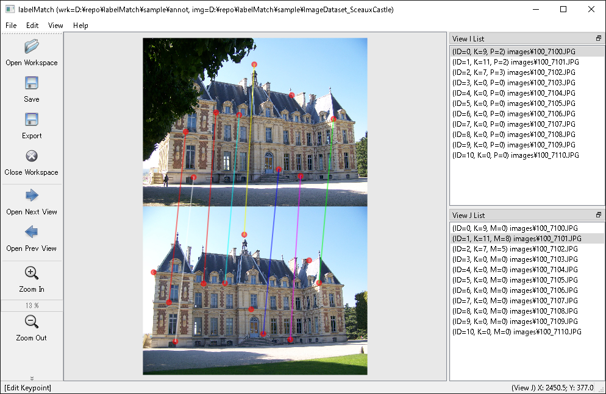

# labelMatch

 labelMatch is a graphical corresponding point annotation tool. In computer vision, normally we decide correspondences of points automatically by a feature point extraction algorithm (e.g. SIFT) and a feature matching algorithm (e.g. Brute Force). But when you want to do it manually, you can use this tool!

<p align="center"></img></p>

## Requirements

* Python3
* PyQT5

## How to Start

### with Binary (Windows only)

You can use binary file. Please download from the [Release](https://github.com/daisatojp/labelMatch/releases).

### with git-clone (Any OS)

```bash
git clone https://github.com/daisatojp/labelMatch.git --recursive
cd labelMatch

# I like virtualenv
python3 -m venv .venv
## Linux
source .venv/bin/activate
## Windows
.\.venv\Scripts\activate

python -m pip install --upgrade pip
# Linux
pip install loguru \
            numpy \
            opencv-python-headless \
            tqdm \
            PyQt5 \
            PyQt5-stubs
# Windows
pip install loguru `
            numpy `
            opencv-python-headless `
            tqdm `
            PyQt5 `
            PyQt5-stubs

# Linux
export PYTHONPATH="."
# Windows
$Env:PYTHONPATH = "."

python labelMatch/__main__.py
```

## Tutorial

* Click `Open Workspace`.
  - Select annotation directory where in you save annotation files.
  - Select image directory where in images are located.
  - Click `OK`
* Select `Edit` > `Edit Keypoint` or just press `v`. You can create a keypoint by clicking images. You can delete a keypoint by double clicking it.
* Select `Edit` > `Edit Match` or just press `e`. You can match two keypoints of each two images by clicking the two keypoints in order. You can delete a match by double clicking a keypoint which is connected to the match.
* You can save annotation file by pushing Save File button or select `File` > `Save File`. If you want to save automatically, select `View` > `Auto Save Mode`.

## Annotation format

You can export annotated data to one json file in the following format.

```text
{
  "views": [
    {
      "id_view": 0,
      "filename": ["dirname", "dirname", ..., "filename"],
      "keypoints": [
        [<x1>, <y1>],
        [<x2>, <y2>],
        ...
      ]
    }
    ...
  ],
  "pairs": [
    {
      "id_view_i": <id of first view>,
      "id_view_j": <id of second view>,
      "matches": [
        [<index of keypoint of first view>, <index of keypoint of second view>],
        [<index of keypoint of first view>, <index of keypoint of second view>],
        ...
      ]
    }
    ...
  ]
}
```

## License

[MIT license](LICENSE)

## Make executable for Windows

```
pip install pyinstaller
pyinstaller labelMatch.spec
```

## Acknowledgment

* [labelImg](https://github.com/tzutalin/labelImg) as a reference
* [Chateau de Sceaux Image Dataset](https://github.com/openMVG/ImageDataset_SceauxCastle) to test software
